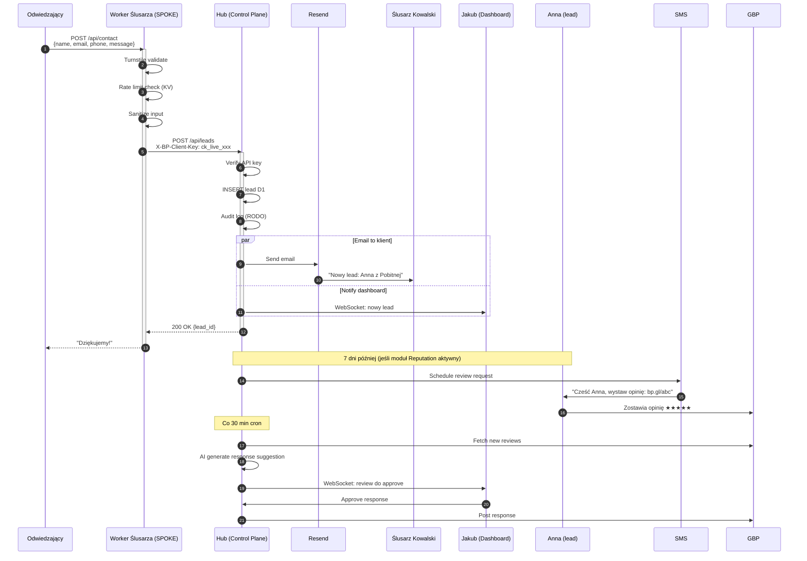
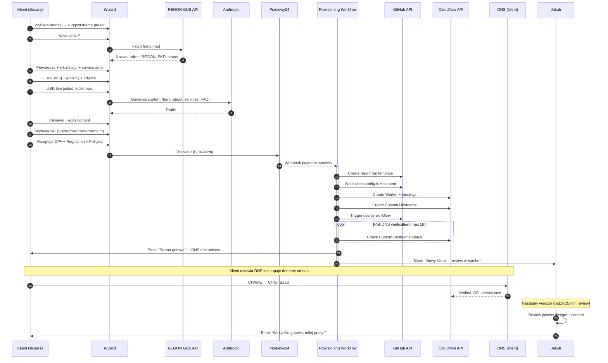
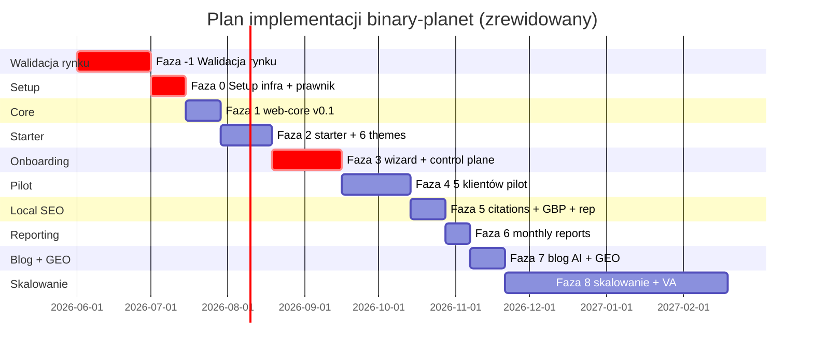
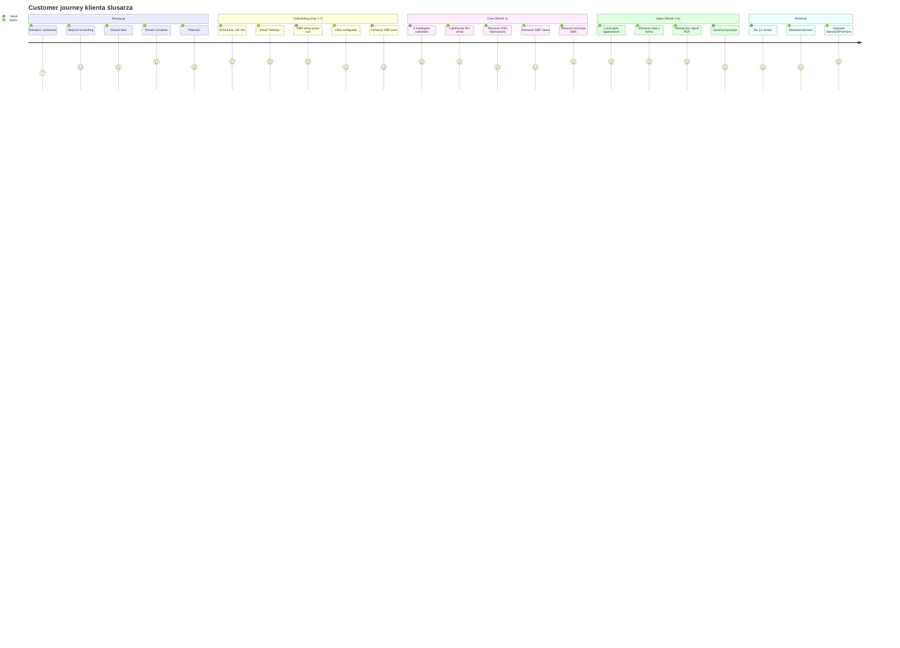
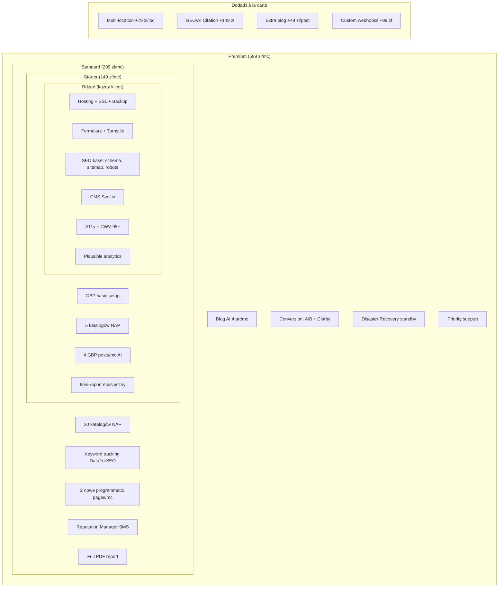

# APPENDIX R — Wizualne diagramy architektury

## R.1 System Overview (hub-and-spoke + external)

```mermaid
graph TB
    subgraph "Twoje konto Cloudflare (HUB)"
        HUB[api.binary-planet.pl<br/>Astro Dashboard + Hono API]
        DB[(D1: clients, subscriptions,<br/>leads, citations, reviews,<br/>blog_drafts, prospects)]
        AE[(Workers Analytics Engine:<br/>page_view, scroll, engagement)]
        R2[(R2: backups, media,<br/>audit logs Parquet)]
        KV[(KV: feature flags,<br/>rate limits, sessions)]
        HUB --- DB
        HUB --- AE
        HUB --- R2
        HUB --- KV
    end
    
    subgraph "Strony klientów (SPOKES)"
        direction LR
        S1[Ślusarz Kowalski<br/>slusarz-kowalski.pl]
        S2[Mechanik Nowak<br/>mechanik-nowak.pl]
        S3[Księgowy Smith<br/>ksiegowy-smith.pl]
        S4[...100+ klientów]
    end
    
    subgraph "External APIs (tylko HUB woła)"
        GSC[Google Search Console]
        GA4[Google Analytics 4]
        GBP[Google Business Profile]
        DFS[DataForSEO]
        ANT[Anthropic Claude]
        RES[Resend Email]
        SMS[SMSAPI.pl]
        STR[Stripe + Przelewy24]
        FAK[Fakturownia.pl]
    end
    
    subgraph "Panel klienta (Customer Portal)"
        PK[panel.binary-planet.pl/...]
    end
    
    S1 -.->|leads + events<br/>X-BP-Client-Key| HUB
    S2 -.->|leads + events| HUB
    S3 -.->|leads + events| HUB
    S4 -.->|leads + events| HUB
    
    HUB ==>|daily pull| GSC
    HUB ==>|daily pull| GA4
    HUB ==>|daily pull| GBP
    HUB ==>|weekly pull| DFS
    HUB ==>|AI gen| ANT
    HUB ==>|email| RES
    HUB ==>|SMS| SMS
    HUB ==>|billing| STR
    HUB ==>|faktury VAT| FAK
    
    PK ==>|leads/metrics view| HUB
```

## R.2 Lead Flow (ktoś wypełnia formularz)

## R.3 Onboarding Flow (klient kupuje, dostaje stronę)

## R.4 Faza implementacji — Gantt

Total: ~9 mc do skalowania (Faza -1 = mc 1, Faza 0-6 = mc 2-5, Faza 7-8 = mc 6-9+).

## R.5 Customer Lifecycle

## R.6 Modules / Pakiety (które klient kupuje)

---
