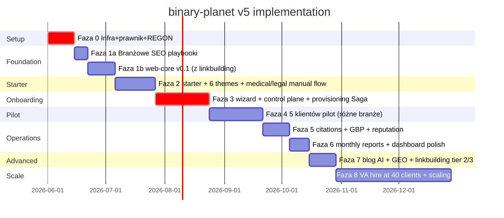

# APPENDIX U — Finalne decyzje + plan implementacji v5

Po dyskusji i review podjęte decyzje:

## U.1 Decyzje strategiczne

| Decyzja | Wybór | Konsekwencja |
|---|---|---|
| Faza -1 walidacja rynku | **POMIJAMY** | Startujemy Fazę 0 bez external validation. Ryzyko: większe. Skraca time-to-MVP o 4-6 tyg. |
| Medical/legal w MVP | **ZOSTAWIAMY, ale BEZ auto-AI-content** | Lekarz/notariusz dostaje stronę z theme preset `medical`/`professional`, ale treść jest pisana ręcznie (przez Jakuba) lub przez klienta w CMS. Setup dla nich = 1990 zł one-time (uzasadnia manual content effort). |
| Runtime architecture | **Wariant 1: 1 Worker per klient** | Start prostszy, łatwiejszy isolation, lepsze dla debugowania. Wbudowujemy migration path do Wariant 2 (multi-tenant) gdyby update propagation stał się problemem ~50+ klientów. |
| Budżet prawny rok 1 | **5-10k zł** | Świadoma decyzja akceptacji wyższego ryzyka prawnego. Mitigation: bardzo proste DPA template (odo24.pl), brak retainer prawnego na start, brak pen-testu rok 1, oszczędność ~20-40k zł. |
| Liczba tierów | **3 (Starter / Standard / Premium)** | Zachowujemy. Premium pozostaje w ofercie ale komunikujemy jako "dla wymagających klientów" — nie ma być silnie pushowany w marketing. |
| VA hire trigger | **40 klientów** | Wcześniejszy outsourcing GBP posts approvals + citation submissions. |

## U.2 Aktualizacje vs plan v4

### Medical/legal handling

**Wizard krok 10 (AI Content) — branch logic:**
```
if (client.industry in ['medical', 'legal']):
  - SKIP automatic AI generation
  - WYŚWIETL: "Treści dla branży medycznej/prawnej wymagają ręcznej weryfikacji.
              Skontaktujemy się z Tobą w 24h aby ustalić content."
  - SET client.content_generation = 'manual_required'
  - SET setup_amount_pln = 199000  (1990 zł)
  - DODAJ task w `inbox` panelu Jakuba: "Manual content brief: {client_id}"
else:
  - Normal AI generation flow
```

**Manual content workflow dla medical/legal (post-onboarding):**
1. Jakub kontaktuje klienta w 24h, briefuje (telefon lub video call)
2. Klient dostarcza: opis usług (od siebie), kwalifikacje + PWZ/uprawnienia, certyfikaty, case studies anonimowe
3. Jakub edytuje content w `content/` markdown ręcznie lub używa Claude jako **wsparcia** (NIE auto-gen), z klauzulą "Treść zweryfikowana przez {client.legal_name}, PWZ {numer}"
4. Footer każdej strony: "Treści informacyjne. Nie zastępują konsultacji ze specjalistą. {disclaimer specyficzny dla branży}"
5. Audit log w D1: kto edytował, kiedy, jakie zmiany (RODO + ślad dowodowy w razie pozwu)

**Compliance:** w DPA dla medical/legal klient explicit potwierdza, że treść została przez niego zweryfikowana (klauzula "Klient ponosi pełną odpowiedzialność za merytoryczną prawidłowość treści publikowanych na swojej stronie").

### Runtime architecture: 1 Worker per klient z migration-ready design

**Zasady budowy (od dnia 1) z myślą o ewentualnej migracji do multi-tenant:**

1. **`client.config.ts` jest jedynym źródłem konfiguracji per klient** — nie wbijamy customów w worker code
2. **Content w `/content/` folderze** — markdown + YAML, łatwo wyciągnąć do R2 jeśli kiedyś migrujemy
3. **Brand tokens w `tokens.css`** — load przez `<link>` w head, runtime-injectable
4. **Worker code 95% identyczny dla wszystkich klientów** — różnice tylko w `wrangler.toml` bindings + secrets
5. **Naming convention strict**: każdy klient ma slug `[slug]-[year]` (np. `slusarz-kowalski-2026`), Worker name = `bp-[slug]`, KV namespace = `bp-[slug]-kv`, R2 bucket = `bp-[slug]-media`

**Update propagation strategy:**

Dla Wariant 1 (1 Worker per klient) z 100+ klientami, security patch core nie może być 100 ręcznych redeployów. Strategia:

```yaml
# .github/workflows/fleet-deploy.yml (w binary-planet-control-plane repo)
name: Fleet Deploy
on:
  workflow_dispatch:
    inputs:
      target_version:
        description: 'web-core version to deploy'
        required: true
      strategy:
        description: 'rollout strategy: canary|all|smoke'
        default: canary

jobs:
  fleet-deploy:
    runs-on: ubuntu-latest
    strategy:
      matrix:
        # Pulled from control plane D1: list of client repos
        client: ${{ fromJSON(needs.discover.outputs.clients) }}
      max-parallel: 5  # 5 deploys at a time (rate limit)
    steps:
      - name: Bump web-core version in client repo
      - name: Open PR with version bump
      - name: Auto-merge if all checks pass
      - name: Trigger client repo deploy workflow
      - name: Wait for deploy success
      - name: Health check post-deploy
      - name: Rollback if health check fails
```

**Canary strategy:**
- Pierwsze 5% klientów (5 z 100) dostaje patch
- Monitor health 1h
- Jeśli OK: kolejne 20%
- Monitor 2h
- Jeśli OK: 100%
- Jeśli FAIL na jakimkolwiek kroku: rollback all

**Renovate bot dla web-core deps:** auto-PR na każdy klient repo gdy nowy patch core dostępny + auto-merge jeśli green CI.

### Storage architecture: split (D1 + Analytics Engine + Logpush)

**Decyzja z review:** D1 nie jest bottleneckiem dla 100 klientów, ale staje się przy 200+ + intensywne event tracking. Wbudowujemy split od początku jako future-proof.

**Schema:**

```
D1 (binary-planet-control-plane-db):
- clients, subscriptions, payments, leads (max 24mc retention)
- citations, gbp_reviews, blog_drafts, prospects
- audit_log (last 90 days, archive starsze do R2)
- health_checks (last 7 days, archive starsze)

Workers Analytics Engine (binary-planet-events):
- page_view, scroll_depth, engagement_time
- phone_click, sms_click, email_click, gbp_click
- form_view, lead_form_submit
- Queryable via SQL przez 90 dni, then archived

Logpush → R2 (binary-planet-logs):
- All Worker logs (structured JSON with client_id)
- Audit log archive (> 90 dni)
- Health check archive (> 7 dni)
- Parquet format dla łatwych analytics queries
- Retention 365 dni
```

### Multi-tenancy isolation rigorous

**Repository pattern (TypeScript, wrap dla D1):**

```typescript
// @binary-planet/control-plane/src/db/repository.ts
export class TenantScopedRepo<T> {
  constructor(
    private db: D1Database,
    private tenantId: string,  // ZAWSZE z auth context, nigdy z request body
    private tableName: string
  ) {}
  
  async findById(id: string): Promise<T | null> {
    return this.db.prepare(
      `SELECT * FROM ${this.tableName} WHERE id = ? AND client_id = ?`
    ).bind(id, this.tenantId).first<T>();
  }
  
  async list(filters: Filters): Promise<T[]> {
    // ALWAYS includes WHERE client_id = ?
    const { sql, params } = buildQuery(filters);
    return this.db.prepare(
      `SELECT * FROM ${this.tableName} WHERE client_id = ? ${sql}`
    ).bind(this.tenantId, ...params).all<T>();
  }
  
  // No raw SQL methods — only scoped operations
}

// Usage in route handler:
const repo = new TenantScopedRepo<Lead>(env.DB, ctx.tenantId, 'leads');
const leads = await repo.list({ orderBy: 'created_at DESC', limit: 50 });
```

**ESLint rule custom (`eslint-plugin-binary-planet/no-raw-sql`):**
```typescript
// Blokuje użycie env.DB.prepare() poza warstwą repository
// Wymusza użycie TenantScopedRepo
```

**API key auth — bound to client_id:**

```typescript
// Klucz API jest hashem z client_id wpiętym
// ck_live_[base64(client_id):signature]
// Spoke wysyła klucz → hub extractuje client_id z klucza, NIGDY z request body
// Jeśli request body ma `client_id` field, jest IGNOROWANY

async function authenticateSpoke(req: Request): Promise<TenantContext> {
  const apiKey = req.headers.get('X-BP-Client-Key');
  const decoded = decodeApiKey(apiKey);  // throws jeśli invalid
  const client = await db.get(`SELECT * FROM clients WHERE id = ? AND status = 'active'`, decoded.clientId);
  if (!client) throw new UnauthorizedError();
  if (!verifySignature(decoded, env.API_KEY_SECRET)) throw new UnauthorizedError();
  return { tenantId: client.id, client };
}
```

### Programmatic pages: cap 10 na start, scale do 40 po 6 mc

**Faza 1: client zaczyna z max 10 programmatic pages** (najczęstsze service × top dzielnice):
- 2-3 usługi × 3-5 dzielnic = 6-15 stron
- Cap hardware w `core/programmatic`: jeśli generator próbuje >10, error

**Po 6 mc** (jeśli `seo_metrics` pokazują >10 impressions/mc dla większości):
- Auto-suggest dodanie kolejnych 10-30 pages
- Klient (lub Jakub) zatwierdza

**Audit script w CI rebuilds:**
- Body content (bez header/footer/nav/NAP) similarity <50% (NIE 70%)
- 4-gram overlap <30%
- Word count >500 unique
- Każda strona ma ≥1 unique local testimonial
- FAIL CI jeśli któreś warunki naruszone

### Branżowe SEO playbooki (PRZED Fazą 2)

Każdy theme preset musi mieć przygotowany playbook w `themes/[preset]/seo-playbook.md`:

```markdown
# SEO Playbook: craftsman (ślusarz)

## Intent mapping
- "ślusarz {city}" — local pack intent, urgency. Cel: pojawić się w map pack
- "awaryjne otwarcie drzwi {city}" — emergency intent. Cel: top 3 SERP + GBP
- "ile kosztuje wymiana zamka" — research intent. Cel: blog article z ceną
- "ślusarz w pobliżu" — proximity intent. Cel: GBP optimization

## Top 20 keywords (per city template)
1. ślusarz {city}
2. ślusarz {city} 24h
3. awaryjne otwarcie {city}
4. wymiana zamka {city}
... (do 20)

## Obligatory schema fields
- @type: Locksmith (subtyp LocalBusiness)
- areaServed: GeoCircle (radius z client.config)
- hasOfferCatalog: lista usług z `priceRange` per usługa
- aggregateRating: jeśli reviews > 5
- knowsLanguage: ["pl-PL"]

## Branżowe link sources (tier 1)
- Cech Rzemieślników w {city}
- Lokalna Izba Gospodarcza
- Strażackie OSP (sponsoring lub partnerstwo dla awaryjnego dojazdu)
- Lokalna gazeta (news o ratowaniu zwierzęcia z mieszkania)

## Content angle (war stories required)
Klient w wizardzie MUSI podać 3-5 sytuacji:
- Najciekawszy case awaryjnego otwarcia
- Najtrudniejszy zamek do wymiany
- Kto był klientem (anonimowo): osoba starsza, mama z małym dzieckiem, etc.
- Co użyto (jakie narzędzia, marki: KESO, Lockmaster, etc.)

## Content format
- Hero: telefon NAJWIĘKSZE, sticky CTA "Zadzwoń teraz"
- About: war stories + lat doświadczenia + cech/izba membership
- Services per usługa: 500+ słów z lokalnym kontekstem
- FAQ: 8 pytań z lokalnym anchor min 2

## SERP layout for branża (analiza top 3 results)
- Map pack: 3 results dominuje top
- Below map pack: usługi-katalog (pkt.pl) #1-2
- Strony własne ślusarzy #3-5
- AI Overview: rzadko (15% queries)
- Brand queries: zawsze #1 dla zarejestrowanej firmy
```

**Playbooki muszą być gotowe przed startem Fazy 2** (theme presets implementation). To dodaje 1-2 tyg do timeline (~research + writing), ale eliminuje próżną pracę w Fazie 2.

### Linkbuilding moduł (`core/linkbuilding`)

NOWY moduł w `@binary-planet/web-core`:

**Tier 1 — must-have dla każdego klienta (auto + manual):**
- Cech Rzemieślników / Izba Gospodarcza wpis (manual submission via wizard data)
- Lokalna gazeta (PR template — wysyłka raz w roku)
- Sponsoring OSP / lokalnego klubu (template ad jeden raz)
- LinkedIn company page (auto-create z client data)

**Tier 2 — Local SEO Pro:**
- HARO PL / PressService — pitches do dziennikarzy (manual, 1-2/mc)
- Guest posts na branżowych blogach (template)
- Partnerstwa z komplementarnymi firmami (np. ślusarz × administrator nieruchomości)

**Tier 3 — Premium:**
- Digital PR campaigns (proaktywne pitching znanych mediów)
- Backlink audit + reclamation (NoFollow → DoFollow conversion attempts)

**Implementacja:** tabela `linkbuilding_tasks` w D1, queue w dashboard, monthly cron progress check.

### EEAT prompty rewrite — war stories required

Aktualizacja wszystkich AI promptów w Appendix D:

**Wizard krok 10 (AI Content) — dodać sekcję BEFORE generation:**

```
"Aby Twoja strona miała autorytet w Google, opowiedz nam o sobie:

1. **3 historie z pracy** — sytuacje które najlepiej pokazują Twoje doświadczenie
   (przykład dla ślusarza: 'Otwierałem mieszkanie staruszki o 3 nad ranem, 
   nie miała kluczy, była zima -15°C. W 25 minut zrobione.')

2. **Lista narzędzi/marek** których używasz (np. KESO, Lockmaster, Schlage)

3. **Lat doświadczenia + certyfikaty/uprawnienia**

4. **Liczba realizacji** (przybliżona: 'około 3000 otwierań od 2010')

5. **Aktualne ceny** głównych usług (orientacyjne, dla 2026)
"
```

**Prompt update — example craftsman/about:**

```
SYSTEM: Jesteś polskim copywriterem dla mikrofirm rzemieślniczych.
Tworzysz teksty z REAL E-E-A-T signals: konkretne war stories, prawdziwe narzędzia, 
prawdziwe lata doświadczenia. NIE wymyślasz danych.

USER:
- Firma: {businessName}
- Branża: {industry}
- Lat: {yearsOfExperience}
- Realizacje liczba: {totalProjects}
- Narzędzia/marki: {tools}
- Certyfikaty: {certifications}
- War stories (3-5): {warStories}
- Aktualne ceny: {currentPrices}

Wygeneruj sekcję "O nas":

{
  "headline": "Max 8 słów z imieniem właściciela",
  "experienceParagraph": "2-3 zdania z konkretną liczbą lat + liczba realizacji",
  "specialtiesParagraph": "Co konkretnie umiemy, jakimi narzędziami (lista marek)",
  "warStoriesSection": [
    "Konkretne 2 z 3-5 podanych historii, sparafrazowane",
    "Druga historia"
  ],
  "credentialsList": ["Certyfikat 1", "Członkostwo cechu", "Uprawnienia"],
  "ctaText": "Zadzwoń teraz"
}

WAŻNE:
- NIE wymyślaj war stories których nie podano w {warStories}
- NIE wymyślaj certyfikatów
- NIE używaj generyków "profesjonalnie", "kompleksowo", "rewolucyjnie"
- Każde stwierdzenie musi być oparte na danych z inputu
```

### Realna ekonomika v5

Po review aktualizujemy oczekiwania (komunikujemy klientom i sobie):

| Metryka | Wartość |
|---|---|
| Time-to-value (Starter) | **6 mc minimum** do widocznego local pack |
| Time-to-value (Standard z Local SEO Pro) | **3-4 mc** do widocznego ranking |
| Czas/mc 100 klientów | **95-130h/mc** (realne) |
| Break-even point | **50-70 klientów** |
| VA hire trigger | **40 klientów** |
| Cap praktyczny solo + 1 VA | **100-120 klientów** |
| Dla 250 klientów | Ty + 1 VA + junior part-time (~12-15k zł/mc dodatkowy koszt) |
| Hidden costs/rok | GitHub Actions Pro (~600 zł), monitoring (~600 zł), ubezpieczenie OC IT (~2000 zł), prawnik retainer (opcjonalne), Fakturownia (~600 zł), domeny (~500 zł) = ~4-5k zł/rok minimum |
| Realny NET MRR 100 klientów | ~17 000 zł/mc (po wszystkich kosztach) |
| Realny NET MRR 250 klientów | ~38 000 zł/mc (po VA + junior + wszystkie koszty) |

### Marketing communication updates

W marketing materials (landing, wizard, email drip) NIE używamy:
- ❌ "Pierwsze efekty SEO w 30 dni" (nieprawda)
- ❌ "100% gwarancja wzrostu" (nielegalna obietnica)
- ❌ "Najlepszy local SEO w Polsce" (nieuczciwa konkurencja)

Używamy:
- ✅ "Pierwsze widoczne wyniki w mapach Google: 14-21 dni"
- ✅ "Pierwszy lead z formularza: typowo 2-4 tygodnie"
- ✅ "Stabilizacja rankingu w local pack: 4-6 miesięcy"
- ✅ "Lighthouse score 95+ — 3× szybsza niż średnia w branży"

## U.3 Updated Roadmap (czas total: ~6-9 mc do skalowania)



**Total: ~5.5 mc** do pierwszych 5 klientów pilotażowych + 60 dni na skalowanie do 40+.

## U.4 Co dokładnie startujemy w Fazie 0 (od jutra)

**Tydzień 1-2 (Faza 0):**

Preflight tasks:
1. [ ] Nazwa produktu — research domeny .pl i .com dostępne
2. [ ] GitHub org założenie + npm registry config
3. [ ] Cloudflare account upgrade (Workers Paid $5/mc)
4. [ ] Konsultacja prawnika RODO/IT (budżet 4-8k zł, ale celujemy w 5-8k przez wybór jednorazowej konsultacji bez retainera)
5. [ ] REGON API request do GUS (mailowy, 1-2 tyg czekania)
6. [ ] Stripe + Przelewy24 konta i KYC
7. [ ] Anthropic, DataForSEO, Resend, SMSAPI, Fakturownia konta i API keys
8. [ ] OVHcloud API key
9. [ ] Better Stack free monitoring
10. [ ] GitHub Pro/Team (dla private repos + Actions minutes)
11. [ ] Wybór nazwy + rejestracja domeny

W tym samym czasie (paralelnie):
- Studium 20 polskich agencji local SEO (research konkurencji)
- Wybór 5-10 testowych klientów potencjalnych (znajomi, lokalne firmy) — do późniejszego pilot
- Setup konta firmowego (jeśli jeszcze nie ma)
- Decyzja: ryczałt 12% IT vs zasady ogólne (z księgową)

Jeśli wszystko go: **Faza 1a startuje za 2-3 tygodnie** (przygotowanie SEO playbooków).

## U.5 Final decisions po re-review v5 (5 agentów)

Re-review verdict: **4/5 GO z minor tweaks, 1/5 Legal NEEDS REWORK**. Decyzje Jakuba po przeglądzie:

| Sprawa | Decyzja | Konsekwencja |
|---|---|---|
| Budżet prawny | **5-10k zł** (mimo silnej rekomendacji legal agenta 15-20k) | Świadome przyjęcie wyższego ryzyka. Mitigation: per-tenant encryption PII (sam zbuduję), bardzo precyzyjny DPA z odo24.pl, brak medical/legal w pierwszych 10 klientach pilotowych, OC IT cyber 500k zł obowiązkowo. |
| Medical/legal | **ZOSTAJE z manual content flow** | Klauzula odpowiedzialności klienta w DPA. Pierwszy klient pilotowy = NIE medical/legal. Po pierwszych 10 klientach review czy włączać. |
| Pre-validation | **COLD OUTREACH FIRST** (telefony + emaile), reklamy/landing dopiero potem | Tańsze niż 200 zł Ads, daje bezpośrednie pytania i sygnał z rynku. Patrz Appendix V. |
| 12 dni operacyjnych | **TAK — wbudowuję w Fazę 0-1** | Runbook + secret rotation + observability MVP przed pierwszym klientem. Patrz Appendix W. |

